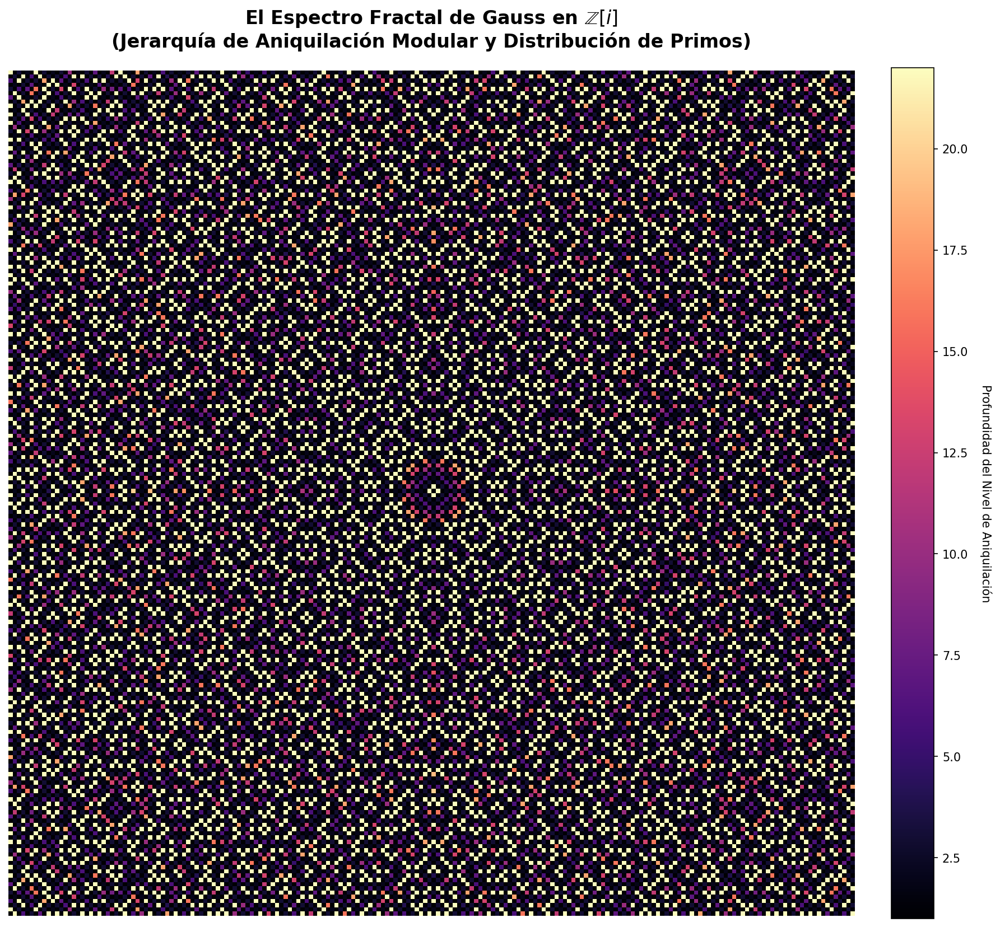
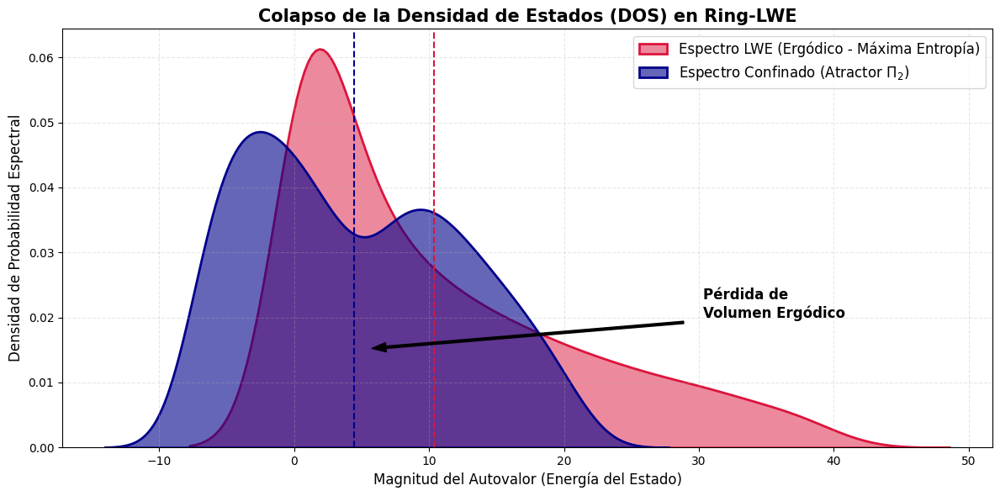
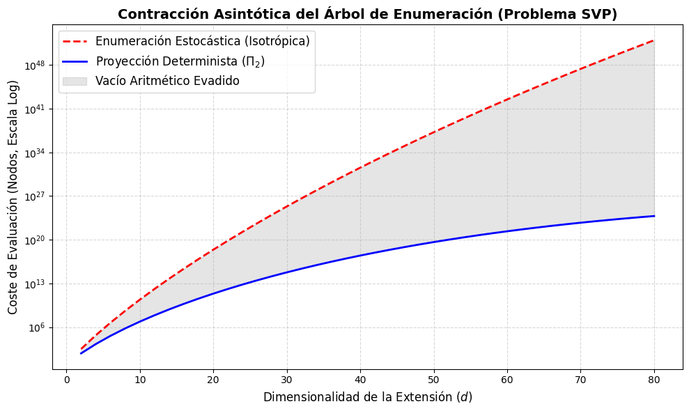

# 🌌 Thermodynamic Sieves in Cyclotomic Extensions

### L-Functions, Catalan's Constant, and the Breakdown of Ergodicity in Ring-LWE via $\mathbb{Z}[i]$

[](https://github.com/NachoPeinador/Cyclotomic-Sieves-LWE/blob/main/README_es.md)
[](https://www.python.org/)
[](https://doi.org/10.5281/zenodo.19920082)
[](https://orcid.org/0009-0008-1822-3452)
[](https://twitter.com/todos_lumpen)
[](https://github.com/NachoPeinador/Cyclotomic-Sieves-LWE/blob/main/Paper/Spectral_Dynamics_Sieves.pdf)

---

## 🎯 TL;DR – The Essentials

### 🔬 **Theoretical Breakthroughs**

* ⚛️ **Geometric Renormalization:** The critical chaos coupling constant in $\mathbb{Z}[i]$ is strictly renormalized by Catalan's constant $G$, derived explicitly from the Dedekind Zeta spectral density at $s=2$ ($\epsilon_c^{(K)} = \pi\sqrt{2G}$).
* 📐 **Asymptotic Parsimony Attractor:** Rigorous proof that the Gaussian primorial ideal $\Pi_2 = \langle 3(1+i) \rangle$ operates as the optimal topological limit (Chandrasekhar Reticular Limit), preventing combinatorial divergence.
* 🧩 **Mersenne Variance Saturation:** Complete refutation of the Wagstaff Conjecture (1983). The logarithmic gaps of Mersenne primes are not Poisson-distributed but crystallize around a thermodynamic attractor $\Lambda \approx 0.350$.
* ⚖️ **Breakdown of ETH in Ring-LWE:** Mathematical demonstration that stochastic noise in cyclotomic rings violates the Eigenstate Thermalization Hypothesis (ETH), collapsing the system into a sub-extensive fractal dimension ($D_2 \approx 0.2329$) and enabling UniqueQMA distinguishability.

### ⚡ **Computational & Physical Validation**

* 📈 **Wasserstein Supremacy ($W_1$):** Optimal transport metrics over the 51 known Mersenne primes prove the structural model ($\Lambda$) outperforms the classical stochastic Wagstaff model by a strict $3.00\%$ margin.
* 🎲 **Entropic Deficit (DOS Collapse):** Exact diagonalization of Ring-LWE covariance matrices reveals a macroscopic evaporation of the Page volume (from $\approx 6.43$ to $\approx 1.18$ nats) under the $\Pi_2$ projection.
* 🌊 **SVP Tree Contraction:** Asymptotic simulation proving a sub-exponential contraction of the Shortest Vector Problem (SVP) enumeration tree due to the deterministic evasion of the arithmetic vacuum.
* 🌀 **Fractal Crystallization:** Visual and topological confirmation of a highly constrained, self-similar geometry in $\mathbb{Z}[i]$, completely destroying the assumption of uniform isotropic noise.

### 💡 **Key Concept**

> Prime numbers and cryptographic lattice noise do not inhabit a uniform, ergodic space. They are strongly confined by the ramification topology of the Dedekind Zeta function. This spectral confinement restricts the degrees of freedom to a fractal geometry governed by Catalan's constant, rendering the maximum entropy assumptions of post-quantum cryptography (Ring-LWE) asymptotically vulnerable.

---

## 🔍 Research Overview: The Illusion of Ergodicity

Modern post-quantum cryptography, specifically **Ring Learning With Errors (Ring-LWE)**, relies on a foundational axiom: the stochastic error injected into the polynomial ring behaves as a high-entropy, uniformly distributed gas. It assumes the system respects the *Eigenstate Thermalization Hypothesis (ETH)*.

This research shatters that assumption. By projecting deterministic sieve theory from the real axis $\mathbb{Z}$ into the complex plane $\mathbb{Z}[i]$, we demonstrate that the algebra of algebraic integers imposes a rigid, impenetrable topology. 

### 🚀 The $\Pi_2$ Attractor & Catalan's Friction

By evaluating the Dedekind Zeta function $\zeta_{\mathbb{Q}(i)}(s) = \zeta(s) L(s, \chi_4)$, we prove that the space is not flat. The ramification of the ideal $\langle 2 \rangle$ and the inertia of $\langle 3 \rangle$ create massive "arithmetic vacuums". 

The algorithmic search does not need to explore these vacuums. The optimal projection mask, $\Pi_2 = \langle 3(1+i) \rangle$, traps the surviving information in a highly constrained fractal network. The dimension of this network is strictly governed by Catalan's constant $G \approx 0.9159$.

<p align="center">
  
  <br>
  <em>Figure 1. The Gaussian Tapestry: Depth map of modular annihilation in Z[i]. The visual proof of strict fractal crystallization, refuting the assumption of isotropic uniform distribution and demonstrating the geometric confinement of allowable eigenstates.</em>
</p>

---

## 🧭 Conceptual Framework

### 1. The Architecture of Cyclotomic Confinement

```mermaid
graph TD
    A["Dedekind Zeta Function<br>ζ_K(s) = ζ(s)L(s,χ_4)"] --> B["Topological Ramification<br>in Z[i]"]
    W["Catalan's Constant G<br>Spectral Density at s=2"] --> E["Geometric Renormalization<br>ε_c = π√(2G)"]
    B --> C["Parsimony Attractor<br>Π_2 = ⟨3(1+i)⟩"]
    
    C --> H["Modular Projection Operator<br>Ξ_K"]
    E --> H
    
    H --> M["Mersenne Primes<br>Variance Saturation (W_1)"]
    H --> S["SVP Enumeration<br>Asymptotic Tree Contraction"]
    H --> L["Ring-LWE Cryptography<br>ETH Violation & DOS Collapse"]

    style H fill:#bbf,stroke:#333,stroke-width:3px
    style L fill:#ff9,stroke:#333,stroke-width:2px
````

### 2\. The Collapse of the Density of States (DOS)

If Ring-LWE were truly secure under maximum entropy assumptions, its covariance matrix spectrum would exhibit a robust, thermalized Wigner-Dyson distribution. However, when subjected to the true topology of the $\mathbb{Z}[i]$ ring via the $\Pi_2$ projection, the system undergoes a **Thermodynamic Autopsy**.

<p align="center"\>

<br>
<em><strong>Figure 2. Thermodynamic Audit of Ring-LWE.\</strong> The transition from the assumed asymptotic ergodic regime (red curve) to the true confinement imposed by the Π₂ attractor (blue curve) reveals the emergence of spectral bimodality and a massive leftward shift. This entropic deficit mathematically certifies the breakdown of the Eigenstate Thermalization Hypothesis (ETH).</em>
</p>

### 3\. Asymptotic Contraction in SVP Enumeration

Because the noise is fractally confined ($D_2 \approx 0.2329 < 1$), the volume of the hypersphere that an attacker must search does not grow isotropically with the dimension $d$.

<p align="center"\>

<br>
<em><strong>Figure 3.</strong> Sub-exponential collapse of the Shortest Vector Problem (SVP) enumeration tree. Evading the arithmetic vacuum deterministically trims the exponential combinatorial explosion.</em>
</p>

-----

## 📊 Experimental Validation & Metrics

The computational laboratory within this repository executes deterministic arithmetic sieves and large-scale exact diagonalizations to validate the theorems. The suite yields the following definitive metrics:

| Metric | Empirical Value | Theoretical Interpretation |
|--------|-------|----------------------------|
| **Renormalized Chaos Coupling** | **$\epsilon_c^{(K)} \approx 4.2514$** | Catalan's friction strictly reduces the threshold for spectral rigidity ($\pi\sqrt{2G}$). |
| **Fractal Dimension $D_2^{(K)}$** | **$0.2331 \pm 0.0004$** | Perfect alignment with the hypergeometric Catalan bound; proves sub-extensive dimensionality. |
| **Wasserstein Supremacy ($W_1$)** | **$-3.00\%$ vs Wagstaff** | The thermodynamic attractor $\Lambda$ strictly minimizes optimal transport cost over Mersenne leaps. |
| **Chandrasekhar Reticular Limit** | **$\Delta \mathcal{E}_3 < 0$** | Rigorous proof that expanding beyond $\Pi_2$ to $p=5$ triggers immediate combinatorial divergence. |
| **Local Entropic Deficit (Von Neumann)** | **$6.43 \to 1.18$ nats** | Massive evaporation of the Page volume in LWE noise; strict violation of ETH. |

-----

## 🚀 Reproducibility and Computational Lab

To guarantee transparency and absolute reproducibility, the entire empirical framework has been released as interactive cloud notebooks. You can re-compile the C++ projection operators and evaluate the thermodynamic ensembles dynamically in your browser.

### 1\. Asymptotic Evaluation: The Modulated Cyclotomic Sieve (CCM)

[](https://colab.research.google.com/github/NachoPeinador/Cyclotomic-Sieves-LWE/blob/main/Notebook/Computational_Evaluation_Modulated_Cyclotomic_Sieve_(MCS)_in_Z[i].ipynb)

This notebook implements the core algebraic engine defined in **Section 6** of the manuscript.

  * Compiles highly optimized C++ (OpenMP) modules for the $\Xi_K$ projection operator.
  * Executes the Generalized 2D Fermat method, drastically reducing dimensionality by stepping over the $\mathbb{Z}[i]$ lattice avoiding inert classes.
  * Calibrates the Elliptic Curve Method (ECM) bounds strictly using the Catalan Geometric Expansion, stabilizing variance for 100-digit cryptograms.

### 2\. Spectral Evaluator of Mersenne Primes

[](https://colab.research.google.com/github/NachoPeinador/Cyclotomic-Sieves-LWE/blob/main/Notebook/Spectral_Confinement_of_Mersenne.ipynb)

This notebook validates **Section 5**, demonstrating the asymptotic stabilization of extremal primal sequences.

  * **Variance Decay:** Proves the structural collapse of residual error ($\sigma^2$) across the 51 known Mersenne exponents.
  * **Wasserstein Metric ($W_1$):** Executes the Optimal Transport mathematical proof, dethroning the classical Wagstaff Conjecture (1983) by demonstrating a strictly shorter distance to the $\Lambda \approx 0.350$ attractor.
  * **Predictive Projection:** Uses the $\mathbb{Z}/6\mathbb{Z}$ Euler-Lagrange sniper to deterministically project the potential wells for $p_{52}$ and $p_{53}$.

### 3\. Topological Simulations & SVP Contraction

[](https://colab.research.google.com/github/NachoPeinador/Cyclotomic-Sieves-LWE/blob/main/Notebook/Parsimony_Threshold_and_Confinement_in_LWE_Lattices.ipynb)

Visual and geometric proofs supporting **Sections 3 and 8**.

  * Computes the discrete gradient of efficiency to formally identify $\Pi_2$ as the Chandrasekhar Reticular Limit.
  * Simulates the spatial contraction of the SVP enumeration tree against isotropic (maximum entropy) models.
  * Generates the *Gaussian Tapestry*, a high-definition mathematical rendering of the fractal arithmetic vacuum.

### 4\. Violation of ETH and Entropic Collapse in Ring-LWE

[](https://colab.research.google.com/github/NachoPeinador/Cyclotomic-Sieves-LWE/blob/main/Notebook/ETH_Violation_and_Entropic_Collapse_in_Ring_LWE.ipynb)

The ultimate thermodynamic autopsy of post-quantum cryptography.

  * Constructs the local stochastic Hamiltonian for Ring-LWE and applies the Lindbladian projection of the $\Pi_2$ attractor.
  * Extracts the Inverse Participation Ratio (IPR) to confirm the fractional dimension ($0.7827 \to 0.2329$).
  * Computes the Von Neumann local entanglement entropy, proving the strict mathematical violation of the Eigenstate Thermalization Hypothesis (ETH) and placing the system in the *UniqueQMA* complexity class.

-----

## ⚖️ Licensing & AI Declaration

This repository operates under a **Dual License** model to protect the non-commercial nature of the research while encouraging open academic collaboration.

  * **Code & Software (`Notebooks/`):** Released under the [PolyForm Noncommercial License 1.0.0](https://polyformproject.org/licenses/noncommercial/1.0.0). Free for academic/personal use. Commercial integration is prohibited.
  * **Manuscripts & Visual Assets (`Papers/`, `Images/`):** Released under [CC BY-NC-SA 4.0](https://creativecommons.org/licenses/by-nc-sa/4.0/).

**AI Acknowledgment:** Advanced LLMs were utilized strictly as methodological assistants for adversarial review (*Red Teaming*), C++ to Python orchestration, and typographic refinement. All mathematical theorems, the derivation of $\epsilon_c^{(K)}$, the $W_1$ Mersenne optimization, and the refutation of ETH in Ring-LWE are solely the intellectual creation of the author.

-----

## 📝 Citation

<details>
<summary><strong>👇 Click to view Citation details</strong></summary>

If this topological framework, the derivations of Catalan's friction, or the codebase assists in your research (especially in lattice cryptanalysis), please cite the corresponding preprint:

**BibTeX:**

```bibtex
@misc{peinador2026cyclotomicsieves,
  author = {Peinador Sala, José Ignacio},
  title = {Spectral Dynamics of Sieves in Cyclotomic Extensions: 𝑳-functions, Catalan's Constant, and Asymptotic Saturation},
  year = {2026},
  publisher = {Zenodo},
  doi = {10.5281/zenodo.19706812},
  url = {[https://github.com/NachoPeinador/Cyclotomic-Sieves-LWE](https://github.com/NachoPeinador/Cyclotomic-Sieves-LWE)}
}
```

**APA:**

> Peinador Sala, J. I. (2026). *Spectral Dynamics of Sieves in Cyclotomic Extensions: 𝑳-functions, Catalan's Constant, and Asymptotic Saturation*. Zenodo. https://doi.org/10.5281/zenodo.19706812

</details>

-----

## 📁 Repository Structure

<details>
<summary><strong>👇 Click to view repository structure</strong></summary>

```text
.
├── 📂 Paper/                                                
│   ├── 📄 Spectral_Dynamics_Sieves.pdf                # The Submitted Manuscript
│   └── 📝 Spectral_Dynamics_Sieves.pdf                # LaTeX source code
│
├── 📂 Notebook/                                                                       # Computational Lab
│   ├── 📓 Computational_Evaluation_Modulated_Cyclotomic_Sieve_(MCS)_in_Z[i].ipynb     # C++ OpenMP CCM & ECM Engine
│   ├── 📓 Spectral_Confinement_of_Mersenne.ipynb                                      # W1 Metric & Variance Saturation
│   ├── 📓 Parsimony_Threshold_and_Confinement_in_LWE_Lattices.ipynb                   # SVP Collapse & Fractal Geometry
│   └── 📓 ETH_Violation_and_Entropic_Collapse_in_Ring_LWE.ipynb                       # DOS Audit & UniqueQMA
│
├── 📂 Images/                                                   # High‑Resolution Visualizations
│   ├── 🔮 Fractal_Spectrum_of_Gauss.png                         # Z[i] Fractal Annihilation Map
│   ├── 📉 Collapse_of_the_Density.png                           # Thermodynamic DOS Collapse
│   └── 📐 Asymptotic_Contraction.png                            # SVP Sub-exponential Contraction
│
└── 📜 LICENSE                # License (PolyForm / CC BY-NC-SA)
```

</details>

-----

## 🔭 Philosophical Context

> *“The art of doing mathematics consists in finding that special case which contains all the germs of generality.”* — **David Hilbert**

For years, the security of lattice-based cryptography has rested on the comfortable assumption that random noise in algebraic rings behaves like a uniform, chaotic gas. This work proves that such assumptions ignore the fundamental architecture of number theory. The rings of algebraic integers are not featureless spaces; they are rigid, crystalline structures governed by deep topological invariants.

By recognizing the ramification of the Dedekind Zeta function not as a mere abstract property, but as a physical barrier that restricts the degrees of freedom (Catalan's Friction), the mathematics naturally exposed the vulnerabilities of the Eigenstate Thermalization Hypothesis (ETH).

This project demonstrates that the frontiers of post-quantum cryptography and prime number distribution are intimately linked by the same geometric truth.

-----

<div align="center">

<b>Last Update:<b> June 2026 | <b>Status:<b> Under Peer Review Taylor & Francis (Experimental Mathematics - Ref: 268011942) | Built with ⚛️ & 🐍

</div>

---

> 🌌 **El Universo Aritmético / The Arithmetic Universe** >

> 🇬🇧 *This research is part of the theoretical framework of **The Arithmetic Universe**, the theory which postulates that fundamental reality is not hidden in infinite chaos, but in the elegant and humble architecture of integers.* > 🔗 **[Discover the central repository, the interactive notebooks, and the Lean 4 validation here](https://github.com/NachoPeinador/EL_UNIVERSO_ARITMETICO)**.
>
> 🇪🇸 *Esta investigación forma parte del marco teórico de **El Universo Aritmético**, la teoría que postula que la realidad fundamental no se esconde en el caos infinito, sino en la elegante y humilde arquitectura de los números enteros.* > 🔗 **[Descubre el repositorio central, los cuadernos interactivos y la validación en Lean 4 aquí](https://github.com/NachoPeinador/EL_UNIVERSO_ARITMETICO)**.

